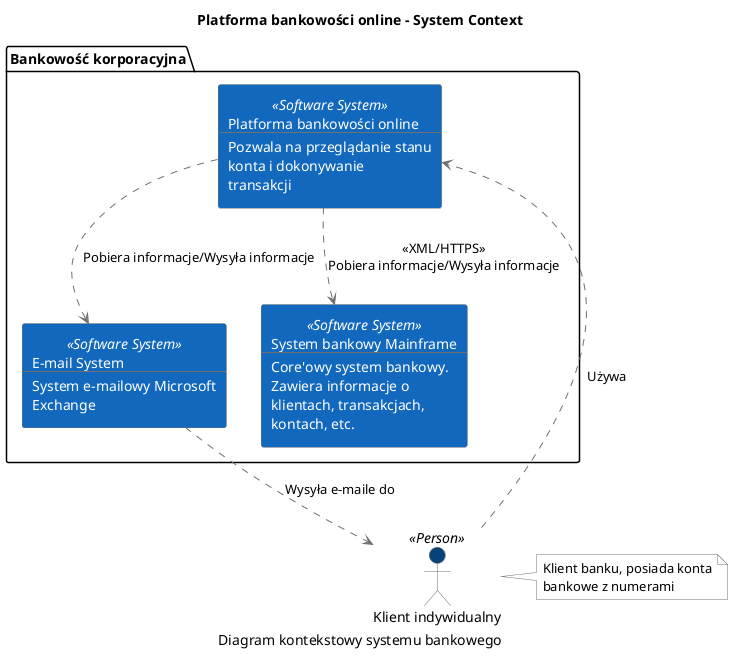
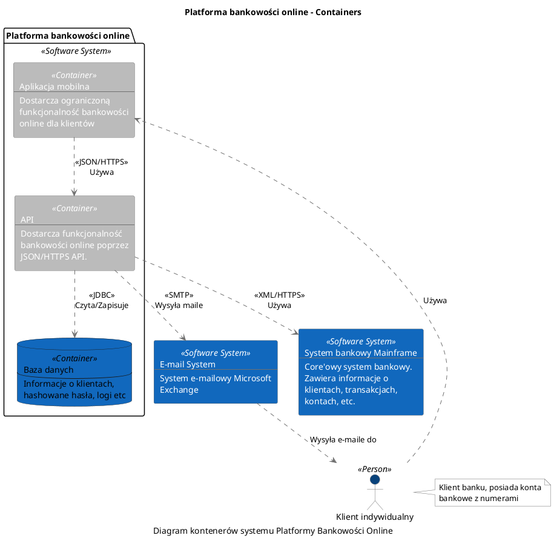
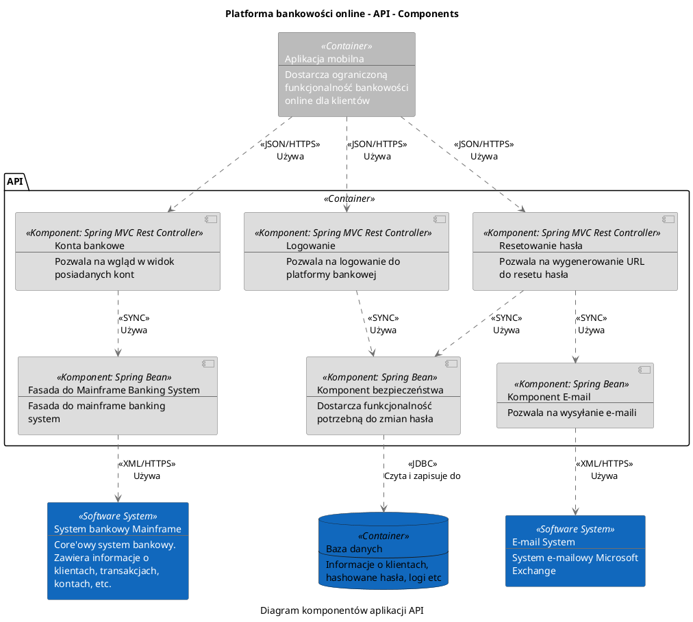

# Model C4 generator based on Structurizr with PlantUML extension

There is a skeleton project showing how to model C4 in Java with PlantUML 
excluding website. It follows OOP approach in place of  structural files.

Run following command to generate charts:
```sh
./gradlew run
```

Look at:
* c1.puml



* c2.puml



* c3.puml



to see generated charts
