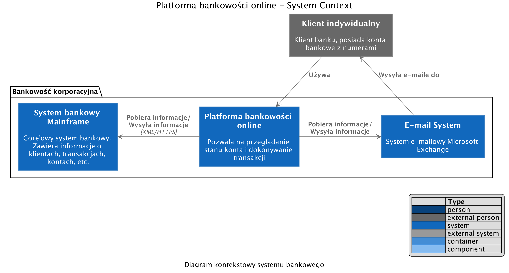
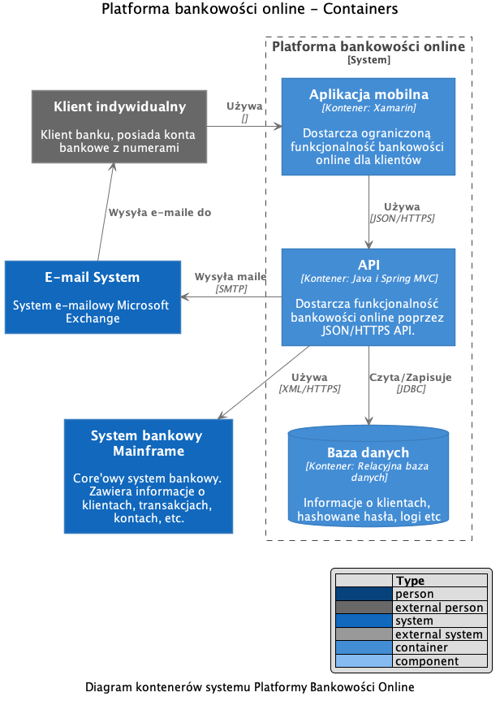
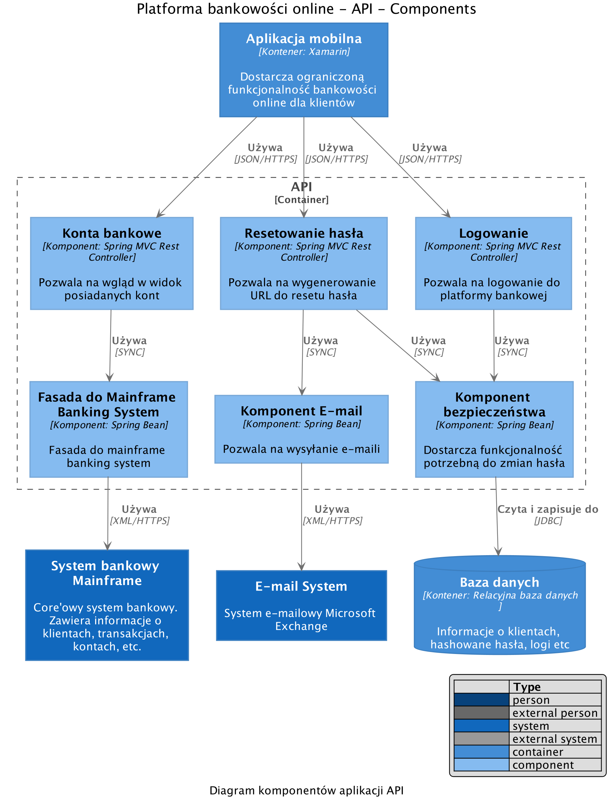

# Model C4 generator based on Structurizr with PlantUML extension

There is a skeleton project showing how to model C4 in Java with PlantUML 
excluding website. It follows OOP approach in place of  structural files.

Run following command to generate `.puml` charts:
```sh
./gradlew run
```

Run following command to generate `.png` charts in `img/` directory:
```sh
./gradlew plantUml
```

#### Requirements

* [Graphviz](https://www.graphviz.org/download/) (may be needed for rendering certain diagrams, use a version defined [here](http://plantuml.com/graphviz-dot))

Look at:
* c1.puml



* c2.puml



* c3.puml



to see generated charts
